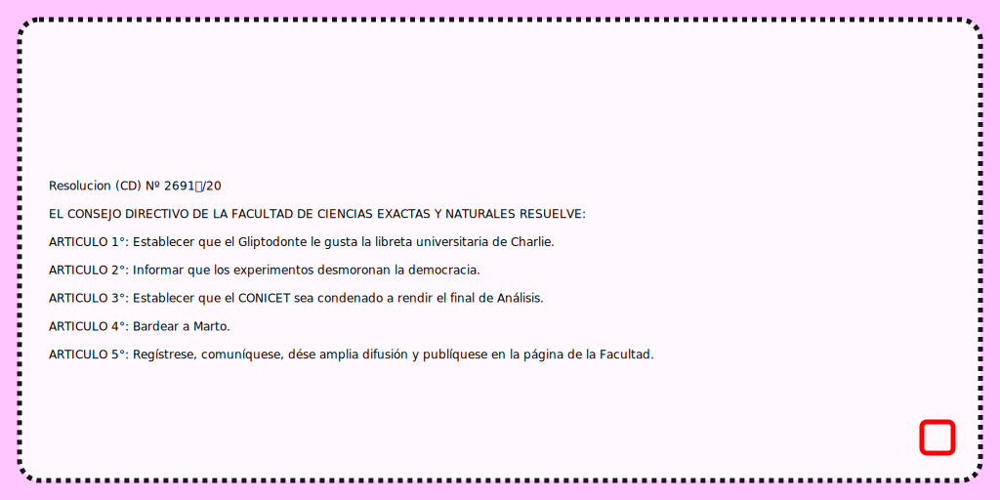

# Consejo Bot Directivo
En este repo se encuentra la gramática de [Tracery](http://tracery.io) usada en el bot https://twitter.com/cd_exactas_bot por [@remruts](https://twitter.com/remruts)

El bot original fue hecho con http://cheapbotsdonequick.com y hosteado en la misma página de manera gratuita. La gramática definida en `bot_CD.json` que usa svgs para las imágenes.

El repo trae una implementación de ejemplo en python 3 que genera imágenes en svg a partir de la gramática. Para usarlo, instalar [pytracery](https://github.com/aparrish/pytracery) y ejecutar

    python3 generador.py > mi_resolucion.svg

### Ejemplo de resolución generada con este script:

## Tutoriales que usé para esto:
- Tutorial de Tracery por su creadora: http://www.crystalcodepalace.com/traceryTut.html
- Tutorial de svg con Tracery: https://github.com/derekahmedzai/cheapbotsdonequick/blob/master/svg-tracery-image-bots.md
- Una respuesta de stackoverflow que perdí que decía que para hacer saltos de línea en svgs tenés que poner el texto entre `<tspan x=\"50\" dy=\"1.2em\">` y `</tspan>`

